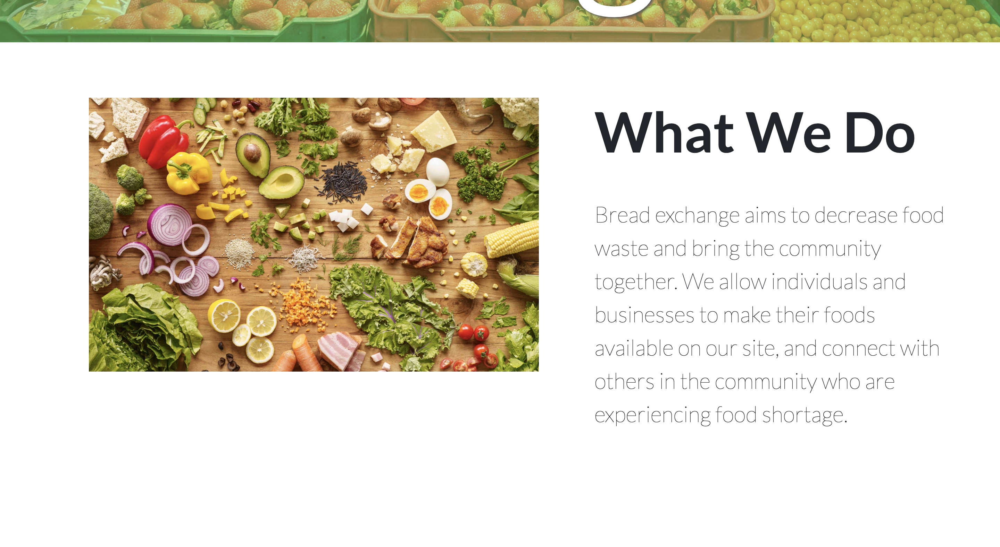

# Bread Exchange

## Table of Contents
[Project Link](#Link)  
[Technologies](#Technologies)  
[Description](#Description)  
[Screenshot](#Screenshot)  
[License](#License)  
[Contact](#Contact)

## Link
https://bread-exchange.herokuapp.com/

## Technologies
HTML, CSS, Javascript, React.js, MongoDB, Mongoose

## Description
Bread exchange is a webpage using the MERN stack which aims to decrease food waste and bring the community together. We allow individuals and businesses to make their foods available on our site, and connect with others in the community who are experiencing food shortages.

## Screenshot

## License
MIT

## Contact
Dalton Wilkins - daltongh@gmail.com  
Tera Howell - terahowell@gmail.com  
Elizabeth Ogbonna - elogtechmail@gmail.com  
Tre Scott - tres1396@gmail.com
